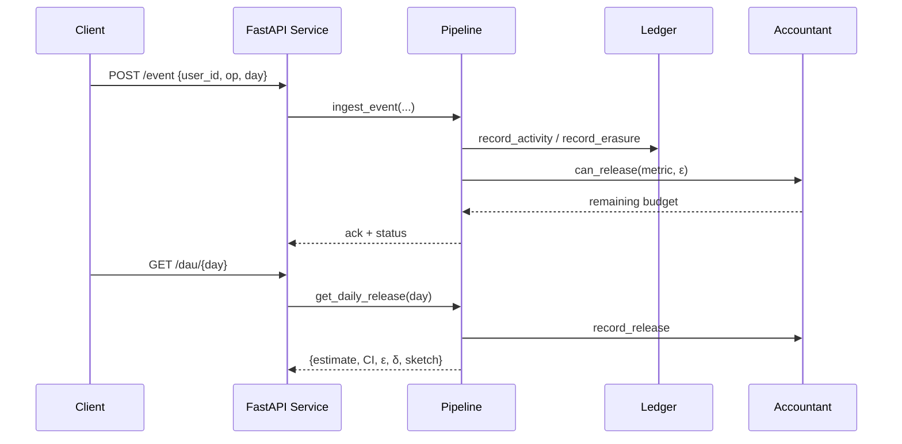

# DP-accurate DAU/MAU Counter Under Deletions

Implement a differential-privacy aware turnstile streaming pipeline that reports distinct Daily Active Users (DAU) and rolling 30-day Monthly Active Users (MAU), while honoring user deletion requests. The proof-of-concept targets correctness, clarity, and reproducibility within four weeks. The default sketch is a KMV bottom-k approximation with optional Bloom-filter aided deletions; an exact set implementation remains for tests, and Theta is available when DataSketches is installed. Laplace/Gaussian mechanisms inject calibrated noise derived from a flippancy bound {{W_BOUND}}.

## Quickstart in 120 seconds
1. `cd dp-dau-mau && python -m venv .venv && source .venv/bin/activate`
2. `pip install -r requirements.txt`
3. *(Optional)* Set overrides for privacy budgets and storage paths. If you skip this step, sensible defaults are loaded automatically. To customise, run a single command such as:

   ```bash
   export DATA_DIR="$PWD/.local-data" \
          EPSILON_DAU=0.3 \
          EPSILON_MAU=0.5 \
          DELTA=1e-6 \
          ADVANCED_DELTA=1e-7 \
          SKETCH_IMPL=kmv \
          SKETCH_K=4096 \
          USE_BLOOM_FOR_DIFF=true \
          BLOOM_FP_RATE=0.01 \
          SERVICE_API_KEY="changeme-super-secret" \
          RDP_ORDERS="2,4,8,16,32" \
          COVERAGE_THRESHOLD=70 \
          HASH_SALT_SECRET=$(python -c "import secrets, base64; print('b64:' + base64.b64encode(secrets.token_bytes(32)).decode())")
   ```

4. In a dedicated terminal tab, run `make run` and leave it running. This starts Uvicorn with `--app-dir src`.
5. In a second terminal, send traffic: `curl -X POST http://127.0.0.1:8000/event -H "Content-Type: application/json" -d '{"events":[{"user_id":"alice","op":"+","day":"2025-10-09"}]}'`
6. Query a release: `curl http://127.0.0.1:8000/dau/2025-10-09`

To protect the API with a key, export `SERVICE_API_KEY=your-secret` before launching and append `-H "X-API-Key: $SERVICE_API_KEY"` to each curl command.

## Core Concepts
- **Turnstile stream**: each record toggles membership with `op` ∈ {`+`, `-`}. Deletes trigger retroactive rebuilds via the erasure ledger.
- **Differential privacy**: per-user sensitivity bounded by {{W_BOUND}}; Laplace noise parameterized by {{EPSILON_DAU}} / {{EPSILON_MAU}} with optional Gaussian via {{DELTA}}.
- **Flippancy**: cap on how often a user can toggle within the reporting horizon.
- **Privacy accounting**: SQLite ledger tracks naive ε spending and Rényi orders {{RDP_ORDERS}}, exposing remaining budget via API/CLI.
- **Sketch abstraction**: choose `{{SKETCH_IMPL}}` = `kmv`, `set`, or `theta`; rebuild strategy documented in `HANDOFF.md`.



## Repository Layout
- `src/dp_core/`: hashing, sketches, DP mechanisms, pipeline, windows, config.
- `src/service/`: FastAPI entrypoint, routes, schemas, auth utilities, OpenAPI tweaks.
- `eval/`: synthetic generators, adversarial workloads, evaluation harness, plots, notebook.
- `cli/dpdau.py`: Typer CLI for ingest/query/eval tasks.
- `tests/`: pytest suites for sketches, DP noise, pipeline, accountant, and service.
- `docker/`: containerization assets; respect `{{DATA_DIR}}` volume mounts.

## Setup & Commands
| Command | Purpose |
| --- | --- |
| `make setup` | Install pre-commit hooks, verify placeholder ledger. |
| `make fmt` | Run `black` + `ruff`. |
| `make lint` | Run `ruff check` and `mypy`. |
| `make test` | Execute pytest with coverage and placeholder check. |
| `make run` | Launch FastAPI via uvicorn (reload). |
| `make eval` | Execute synthetic workload in `eval/evaluate.py`. |
| `make plots` | Generate plots under `{{DATA_DIR}}/plots/{{EXPERIMENT_ID}}/`. |

## API Examples
- Ingest batch: `curl -X POST http://localhost:8000/event -H "Content-Type: application/json" -d '{"events":[{"user_id":"u1","op":"+","day":"2025-10-01"},{"user_id":"u1","op":"-","day":"2025-10-01"}]}'`
- Query DAU: `curl http://localhost:8000/dau/2025-10-01`
- Query MAU: `curl "http://localhost:8000/mau?end=2025-10-31&window={{MAU_WINDOW_DAYS}}"`
- Inspect budget ledger: `curl "http://localhost:8000/budget/mau?day=2025-10-31"`
- Metrics: scrape Prometheus counters at `/metrics`; latency histograms per route.

Every metric response now returns a `budget` object containing `epsilon_spent`, `epsilon_remaining`, `epsilon_cap`, and the best Rényi-derived `(ε,δ)` pair.

## CLI Helpers
- `dpdau ingest --from path/to/events.jsonl` loads JSONL or CSV events into the pipeline (CSV columns: `user_id`, `op`, `day`, optional `metadata.*`).
- `dpdau ingest dataset.jsonl --host http://127.0.0.1:8000 --api-key $SERVICE_API_KEY` pushes the same events through the running API.
- `dpdau dau 2025-10-01` and `dpdau mau 2025-10-31 --window {{MAU_WINDOW_DAYS}}` mirror the HTTP endpoints; add `--host` / `--api-key` to query the service instead of the local pipeline.
- `dpdau generate-synthetic --days 30 --daily-users 500 --delete-rate 0.1 --out {{EXAMPLE_DATASET_PATH}}` emits a demo workload honoring delete traffic.
- `python tools/export_budget_report.py --sample-days 3 --daily-users 100` snapshots DP budget state to `{{DATA_DIR}}/reports/budget-snapshot.json` (run automatically by `make test` for CI artifacts).

## Budget Observability & Alerts
- Every `make test` invocation now emits `{{DATA_DIR}}/reports/budget-snapshot.json` capturing the latest DAU/MAU ε spend, Rényi curve, and advanced-composition bound `(advanced_epsilon, advanced_delta)`; upload alongside `coverage.xml` in CI for traceability.
- To baseline traffic, monitor `/metrics` counters (`app_requests_total`, `app_requests_5xx_total`, `app_request_latency_seconds_*`). Configure alerting to page on sustained `app_requests_total{handler="/event"}` growth without matching latency improvements, and fire a high-severity alert when you observe >10 `app_requests_5xx_total` increments within five minutes.
- Budget exhaustion returns HTTP 429 with a structured payload containing the current spend, cap, and next reset window; on-call runbooks should capture this payload plus the latest budget snapshot.
- For incident handoffs, include the budget snapshot plus `curl /budget/{metric}` outputs alongside Prometheus scrapes.

## Metrics
- The `/metrics` endpoint emits Prometheus text exposition with per-route counters and latency histograms:

  ```
  app_requests_total{handler="/event",method="POST",status="202"} 42
  app_requests_5xx_total{handler="/event",method="POST"} 0
  app_request_latency_seconds_bucket{handler="/dau",method="GET",le="0.50"} 18
  app_request_latency_seconds_sum{handler="/dau",method="GET"} 3.241
  ```
- Alerting thresholds should key off `app_requests_5xx_total` and the histogram P99 bucket for `/event` and `/dau`.

## Load Testing
- Install the optional dependency: `pip install .[load]` (or `pip install locust`).
- Run a headless stress test against a local service:  
  `SERVICE_API_KEY=dev-secret-key make load-test LOAD_USERS=2000 LOAD_SPAWN=500 LOAD_RUNTIME=5m LOAD_HOST=http://127.0.0.1:8000`
- The Locust harness (`load/locustfile.py`) generates batched `/event` traffic and probes `/dau`/`/mau`; adjust `LOAD_TEST_SEED` to reproduce runs.
- Inspect Locust CSV/HTML output (if enabled) alongside `/metrics` to verify the pipeline sustains 10–50k events/s.

## Evaluation Workflow
Run `python eval/simulate.py --users {{N_USERS}} --p-active {{P_ACTIVE}} --delete-rate {{DELETE_RATE}} --days 60 --out {{DATA_DIR}}/streams/sim.jsonl`. Reproduce accuracy curves via `python eval/evaluate.py --sketches set theta --epsilons 0.1 0.3 0.5`. `eval/plots.py` exports Matplotlib PNGs to `{{DATA_DIR}}/plots/{{EXPERIMENT_ID}}/`. Notebook `eval/notebooks/evaluation.ipynb` stitches figures into a reproducible story; update metadata after major changes.

## Changelog
- **Phase 2 (October 2025)**
  - Switched the default sketch to a KMV bottom-k implementation with optional Bloom-filter assisted deletions; set remains for deterministic tests.
  - Extended the privacy accountant and `/budget` endpoint with advanced-composition bounds, release counts, and a structured 429 response when budgets run dry.
  - Reworked `/metrics` to expose `app_requests_total`, `app_requests_5xx_total`, and latency histograms suitable for Prometheus scraping.
  - Upgraded the Typer CLI with `--host`/`--api-key` flags so ingestion and queries can exercise a running service; added a Locust harness and a smoke script.
  - Hardened CI: coverage threshold {{COVERAGE_THRESHOLD}}, budget snapshot artefacts, and expanded pytest/Hypothesis/CLI/E2E coverage.

## Limitations
- PoC assumes single-process SQLite; scale-out requires queueing and shared stores.
- Theta and HLL++ implementations degrade gracefully when optional deps missing; rebuild strategy may be costly.
- Privacy accountant tracks naive ε and configurable RDP orders but lacks advanced composition/auto-tuning.
- High-delete adversaries may trigger full window rebuilds; optimization ideas listed in `HANDOFF.md`.
