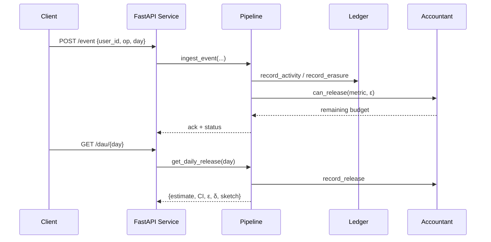

# DP-accurate DAU/MAU Counter Under Deletions

Implement a differential-privacy aware turnstile streaming pipeline that reports distinct Daily Active Users (DAU) and rolling 30-day Monthly Active Users (MAU), while honoring user deletion requests. The proof-of-concept targets correctness, clarity, and reproducibility within four weeks. Two sketch implementations (exact set and approximate Theta/HLL++) sit behind a shared interface, and Laplace/Gaussian mechanisms inject calibrated noise derived from a flippancy bound {{W_BOUND}}.

## Quickstart in 120 seconds
1. `cd dp-dau-mau && python -m venv .venv && source .venv/bin/activate`
2. `pip install -r requirements.txt`
3. *(Optional)* Set overrides for privacy budgets and storage paths. If you skip this step, sensible defaults are loaded automatically. To customise, run a single command such as:

   ```bash
   export DATA_DIR="$PWD/.local-data" \
          EPSILON_DAU=0.3 \
          EPSILON_MAU=0.5 \
          DELTA=1e-6 \
          SKETCH_IMPL=set \
          HASH_SALT_SECRET=$(python -c "import secrets, base64; print('b64:' + base64.b64encode(secrets.token_bytes(32)).decode())")
   ```

4. In a dedicated terminal tab, run `make run` and leave it running. This starts Uvicorn with `--app-dir src`.
5. In a second terminal, send traffic: `curl -X POST http://127.0.0.1:8000/event -H "Content-Type: application/json" -d '{"events":[{"user_id":"alice","op":"+","day":"2025-10-09"}]}'`
6. Query a release: `curl http://127.0.0.1:8000/dau/2025-10-09`

To protect the API with a key, export `SERVICE_API_KEY=your-secret` before launching and append `-H "X-API-Key: $SERVICE_API_KEY"` to each curl command.

## Core Concepts
- **Turnstile stream**: each record toggles membership with `op` ∈ {`+`, `-`}. Deletes trigger retroactive rebuilds via the erasure ledger.
- **Differential privacy**: per-user sensitivity bounded by {{W_BOUND}}; Laplace noise parameterized by {{EPSILON_DAU}} / {{EPSILON_MAU}} with optional Gaussian via {{DELTA}}.
- **Flippancy**: cap on how often a user can toggle within the reporting horizon.
- **Sketch abstraction**: choose `{{SKETCH_IMPL}}` = `set`, `theta`, or `hllpp`; rebuild strategy documented in `HANDOFF.md`.



## Repository Layout
- `src/dp_core/`: hashing, sketches, DP mechanisms, pipeline, windows, config.
- `src/service/`: FastAPI entrypoint, routes, schemas, auth utilities, OpenAPI tweaks.
- `eval/`: synthetic generators, adversarial workloads, evaluation harness, plots, notebook.
- `cli/dpdau.py`: Typer CLI for ingest/query/eval tasks.
- `tests/`: pytest suites for sketches, DP noise, pipeline, accountant, and service.
- `docker/`: containerization assets; respect `{{DATA_DIR}}` volume mounts.

## Setup & Commands
| Command | Purpose |
| --- | --- |
| `make setup` | Install pre-commit hooks, verify placeholder ledger. |
| `make fmt` | Run `black` + `ruff`. |
| `make lint` | Run `ruff check` and `mypy`. |
| `make test` | Execute pytest with coverage and placeholder check. |
| `make run` | Launch FastAPI via uvicorn (reload). |
| `make eval` | Execute synthetic workload in `eval/evaluate.py`. |
| `make plots` | Generate plots under `{{DATA_DIR}}/plots/{{EXPERIMENT_ID}}/`. |

## API Examples
- Ingest batch: `curl -X POST http://localhost:8000/event -H "Content-Type: application/json" -d '{"events":[{"user_id":"u1","op":"+","day":"2025-10-01"},{"user_id":"u1","op":"-","day":"2025-10-01"}]}'`
- Query DAU: `curl http://localhost:8000/dau/2025-10-01`
- Query MAU: `curl "http://localhost:8000/mau?end=2025-10-31&window={{MAU_WINDOW_DAYS}}"``
- Metrics: scrape Prometheus counters at `/metrics`; latency histograms per route.

## Evaluation Workflow
Run `python eval/simulate.py --users {{N_USERS}} --p-active {{P_ACTIVE}} --delete-rate {{DELETE_RATE}} --days 60 --out {{DATA_DIR}}/streams/sim.jsonl`. Reproduce accuracy curves via `python eval/evaluate.py --sketches set theta --epsilons 0.1 0.3 0.5`. `eval/plots.py` exports Matplotlib PNGs to `{{DATA_DIR}}/plots/{{EXPERIMENT_ID}}/`. Notebook `eval/notebooks/evaluation.ipynb` stitches figures into a reproducible story; update metadata after major changes.

## Limitations
- PoC assumes single-process SQLite; scale-out requires queueing and shared stores.
- Theta and HLL++ implementations degrade gracefully when optional deps missing; rebuild strategy may be costly.
- Privacy accountant uses naïve composition; integrate RDP or moments accountant later.
- High-delete adversaries may trigger full window rebuilds; optimization ideas listed in `HANDOFF.md`.
